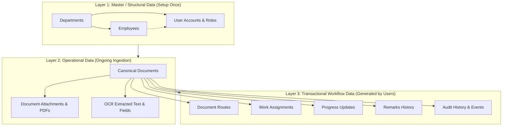

# CDTRS — Complete Real Data Ingestion & Database Management Guide

This comprehensive guide explains how to transition from **mock/demo test data** to **real institutional data** in the **CDTRS (Centralised Document Tracking and Routing System)**.

---

## Table of Contents
1. [Understanding the Data Architecture](#1-understanding-the-data-architecture)
2. [Data Layers Overview](#2-data-layers-overview)
3. [Step-by-Step Transition Plan (Demo to Real Data)](#3-step-by-step-transition-plan-demo-to-real-data)
4. [Method 1: Ingestion via Custom Python Script (Recommended)](#4-method-1-ingestion-via-custom-python-script-recommended)
5. [Method 2: Ingestion from CSV / Excel Spreadsheets](#5-method-2-ingestion-from-csv--excel-spreadsheets)
6. [Method 3: Ingestion via Application UI & REST API](#6-method-3-ingestion-via-application-ui--rest-api)
7. [Database Tables & Column Reference](#7-database-tables--column-reference)
8. [File Storage Architecture for Real Documents](#8-file-storage-architecture-for-real-documents)
9. [Database Backup, Restore & Maintenance](#9-database-backup-restore--maintenance)
10. [Changing & Resetting User Passwords](#10-changing--resetting-user-passwords)

---

## 1. Understanding the Data Architecture

CDTRS operates with two distinct data modes:

| Mode | Location | Purpose | How Data is Stored |
|:---|:---|:---|:---|
| **Mock Mode** (`CDTRS_DATA_SOURCE=mock`) | `frontend/repositories/mock_repository.py` | Standalone UI testing, offline demonstration | In-memory Python lists and dictionaries (resets on app close). |
| **Live Database Mode** (`CDTRS_DATA_SOURCE=api`) | PostgreSQL Database via `backend/` | Production, Multi-PC LAN, Real Workflows | Persistent relational database tables on disk. |

When adding real organizational data, you will be populating your **PostgreSQL Database** connected to the FastAPI backend.

---

## 2. Data Layers Overview

Institutional data in CDTRS is categorized into three hierarchical layers:



### 1. Master Data (Prerequisite)
- **Departments:** Finance, Procurement, Administration, Technical, Legal, HR, etc.
- **Employees:** Real personnel details (Code, Name, Designation, Department).
- **User Accounts:** System logins (`username`, `password_hash`, `role`, linked `department_id` and `employee_id`).

### 2. Operational Data (Real Documents)
- Incoming letters, directives, sanctions, RFPs, and memos.
- Metadata: Reference No, Title, Source Organization, Priority, Deadline, Received Date.
- Physical files: PDF, DOCX, PNG, JPG scans stored in `./uploads/<year>/<doc_id>/`.

### 3. Transactional Data (Automatic)
- Created automatically when users route documents, enter Director/HOD remarks, assign tasks, submit progress, and close documents.

---

## 3. Step-by-Step Transition Plan (Demo to Real Data)

Follow this 5-step roadmap to transition your system from test data to real production data:

```text
Step 1: Clean Existing Test Documents
   ↓
Step 2: Define Real Departments & Organizational Hierarchy
   ↓
Step 3: Create Real Employee Profiles & User Login Credentials
   ↓
Step 4: Ingest Historical / Active Documents & PDF Files
   ↓
Step 5: Verify Live Workflows via Desktop Application
```

### Step 1: Clean Existing Test Documents
To clear previous demo/test documents without deleting user accounts or department tables:
```powershell
python backend/clear_documents.py
```
*(This cleans `documents`, `attachments`, `routes`, `assignments`, `progress`, and `audit` records).*

---

## 4. Method 1: Ingestion via Custom Python Script (Recommended)

You can create a custom script to populate your real departments, staff, and users programmatically.

### Script Template: `backend/seed_custom_real_data.py`

Create a file at [`backend/seed_custom_real_data.py`](file:///c:/CDTRS-master/backend/seed_custom_real_data.py):

```python
import os
import sys
from pathlib import Path

# Ensure backend directory is accessible
BASE_DIR = Path(__file__).resolve().parent
if str(BASE_DIR) not in sys.path:
    sys.path.insert(0, str(BASE_DIR))

import models
import crud
from database import engine, SessionLocal
from models import UserRole, Priority, SourceType, DocumentStatus, WorkflowStage

def seed_real_organization():
    print("Connecting to PostgreSQL database...")
    models.Base.metadata.create_all(bind=engine)
    db = SessionLocal()

    try:
        # =========================================================================
        # 1. ADD YOUR REAL DEPARTMENTS
        # =========================================================================
        print("\n--- Adding Real Departments ---")
        real_departments = [
            {"name": "Administration", "code": "ADMIN"},
            {"name": "Finance & Accounts", "code": "FIN"},
            {"name": "Procurement & Contracts", "code": "PROC"},
            {"name": "Technical & IT Infrastructure", "code": "TECH"},
            {"name": "Human Resources", "code": "HR"},
            {"name": "Legal & Compliance", "code": "LEGAL"},
        ]

        dept_map = {}
        for d_data in real_departments:
            existing = db.query(models.Department).filter(models.Department.name == d_data["name"]).first()
            if not existing:
                dept = models.Department(name=d_data["name"], code=d_data["code"], is_active=True)
                db.add(dept)
                db.commit()
                db.refresh(dept)
                dept_map[d_data["name"]] = dept.id
                print(f"  ✓ Added Department: {dept.name} (ID: {dept.id})")
            else:
                dept_map[d_data["name"]] = existing.id
                print(f"  • Existing Department: {existing.name} (ID: {existing.id})")

        # =========================================================================
        # 2. ADD YOUR REAL EMPLOYEES
        # =========================================================================
        print("\n--- Adding Real Employees ---")
        real_employees = [
            {"code": "EMP-1001", "name": "Rajesh Sharma", "dept": "Finance & Accounts", "designation": "Senior Accounts Officer"},
            {"code": "EMP-1002", "name": "Sunita Rao", "dept": "Finance & Accounts", "designation": "Budget Analyst"},
            {"code": "EMP-2001", "name": "Amit Patel", "dept": "Procurement & Contracts", "designation": "Procurement Manager"},
            {"code": "EMP-2002", "name": "Kavita Menon", "dept": "Procurement & Contracts", "designation": "Purchase Officer"},
            {"code": "EMP-3001", "name": "Vikram Singh", "dept": "Technical & IT Infrastructure", "designation": "Systems Architect"},
        ]

        emp_map = {}
        for e_data in real_employees:
            dept_id = dept_map.get(e_data["dept"])
            existing = db.query(models.Employee).filter(models.Employee.employee_code == e_data["code"]).first()
            if not existing:
                emp = models.Employee(
                    employee_code=e_data["code"],
                    full_name=e_data["name"],
                    department_id=dept_id,
                    designation=e_data["designation"],
                    is_active=True
                )
                db.add(emp)
                db.commit()
                db.refresh(emp)
                emp_map[e_data["code"]] = emp.id
                print(f"  ✓ Added Employee: {emp.full_name} [{emp.employee_code}]")
            else:
                emp_map[e_data["code"]] = existing.id
                print(f"  • Existing Employee: {existing.full_name}")

        # =========================================================================
        # 3. ADD REAL USER ACCOUNTS & PASSWORDS
        # =========================================================================
        print("\n--- Adding Real User Login Accounts ---")
        real_users = [
            # Executive Leadership
            {
                "username": "ds_admin",
                "password": "SecurePassword@2026",
                "full_name": "Director Secretary Office",
                "role": UserRole.DS,
                "dept": "Administration",
                "emp_code": None
            },
            {
                "username": "director_exec",
                "password": "SecurePassword@2026",
                "full_name": "Dr. V. K. Raman (Director)",
                "role": UserRole.DIRECTOR,
                "dept": None,
                "emp_code": None
            },
            # Heads of Departments (HODs)
            {
                "username": "hod_finance_real",
                "password": "SecurePassword@2026",
                "full_name": "Head of Finance & Accounts",
                "role": UserRole.HOD,
                "dept": "Finance & Accounts",
                "emp_code": None
            },
            {
                "username": "hod_procurement_real",
                "password": "SecurePassword@2026",
                "full_name": "Head of Procurement",
                "role": UserRole.HOD,
                "dept": "Procurement & Contracts",
                "emp_code": None
            },
            # Staff Employees
            {
                "username": "emp_rajesh",
                "password": "SecurePassword@2026",
                "full_name": "Rajesh Sharma",
                "role": UserRole.EMPLOYEE,
                "dept": "Finance & Accounts",
                "emp_code": "EMP-1001"
            },
            {
                "username": "emp_amit",
                "password": "SecurePassword@2026",
                "full_name": "Amit Patel",
                "role": UserRole.EMPLOYEE,
                "dept": "Procurement & Contracts",
                "emp_code": "EMP-2001"
            }
        ]

        for u_data in real_users:
            existing = crud.get_user_by_username(db, u_data["username"])
            if not existing:
                dept_id = dept_map.get(u_data["dept"]) if u_data["dept"] else None
                emp_id = emp_map.get(u_data["emp_code"]) if u_data["emp_code"] else None
                user = models.User(
                    username=u_data["username"],
                    password_hash=crud.hash_password(u_data["password"]),
                    full_name=u_data["full_name"],
                    role=u_data["role"],
                    department_id=dept_id,
                    employee_id=emp_id,
                    is_active=True
                )
                db.add(user)
                db.commit()
                db.refresh(user)

                # Link employee back to user
                if emp_id:
                    db_emp = db.query(models.Employee).filter(models.Employee.id == emp_id).first()
                    if db_emp and not db_emp.user_id:
                        db_emp.user_id = user.id
                        db.commit()

                print(f"  ✓ Created Account: {user.username} ({user.role.value})")
            else:
                print(f"  • Existing Account: {existing.username}")

        print("\n" + "=" * 60)
        print("✅ REAL DATA SEEDING COMPLETE!")
        print("=" * 60)

    except Exception as e:
        print(f"❌ Error while adding real data: {e}")
        db.rollback()
    finally:
        db.close()

if __name__ == "__main__":
    seed_real_organization()
```

### To run this script:
```powershell
python backend/seed_custom_real_data.py
```

---

## 5. Method 2: Ingestion from CSV / Excel Spreadsheets

If your organization manages departments, staff, and initial documents in spreadsheets (Excel or CSV), you can bulk import them using Python.

### 1. Prepare CSV Files

#### `departments.csv`
```csv
name,code
Finance & Accounts,FIN
Procurement & Contracts,PROC
Administration,ADMIN
Human Resources,HR
Technical Services,TECH
```

#### `employees.csv`
```csv
employee_code,full_name,department_name,designation
EMP-001,Rajesh Sharma,Finance & Accounts,Senior Accounts Officer
EMP-002,Sunita Rao,Finance & Accounts,Budget Analyst
EMP-003,Amit Patel,Procurement & Contracts,Procurement Specialist
EMP-004,Kavita Menon,Procurement & Contracts,Purchase Officer
```

#### `users.csv`
```csv
username,password,full_name,role,department_name,employee_code
ds_office,AdminSecure#2026,Director Secretary Office,DS,Administration,
director_exec,DirectorSecure#2026,Executive Director,DIRECTOR,,
hod_finance,HodSecure#2026,HOD Finance,HOD,Finance & Accounts,
hod_procure,HodSecure#2026,HOD Procurement,HOD,Procurement & Contracts,
emp_rajesh,EmpSecure#2026,Rajesh Sharma,EMPLOYEE,Finance & Accounts,EMP-001
emp_amit,EmpSecure#2026,Amit Patel,EMPLOYEE,Procurement & Contracts,EMP-003
```

#### `initial_documents.csv` (Optional Historical Ingestion)
```csv
reference_number,subject,source_type,sender_organization,priority,deadline
CDTRS/2026/FIN/001,Annual Budget Allocation FY 2026-27,GOVERNMENT_MAIL,Ministry of Finance,HIGH,2026-09-15
CDTRS/2026/PROC/002,Server Infrastructure Procurement Sanction,OUTLOOK,State IT Directorate,MEDIUM,2026-09-30
```

### 2. Bulk Import Python Script: `backend/import_from_csv.py`

Create [`backend/import_from_csv.py`](file:///c:/CDTRS-master/backend/import_from_csv.py):

```python
import csv
import os
import sys
from pathlib import Path
from datetime import datetime

BASE_DIR = Path(__file__).resolve().parent
if str(BASE_DIR) not in sys.path:
    sys.path.insert(0, str(BASE_DIR))

import models
import crud
from database import engine, SessionLocal
from models import UserRole, Priority, SourceType, DocumentStatus, WorkflowStage

def import_csv_data(csv_dir: str = "./data_import"):
    path = Path(csv_dir)
    if not path.exists():
        print(f"Directory {csv_dir} does not exist. Creating it...")
        path.mkdir(parents=True, exist_ok=True)
        print(f"Place your departments.csv, employees.csv, users.csv in {path.resolve()}")
        return

    models.Base.metadata.create_all(bind=engine)
    db = SessionLocal()

    try:
        dept_map = {}
        # 1. Import Departments
        dept_csv = path / "departments.csv"
        if dept_csv.exists():
            with open(dept_csv, mode="r", encoding="utf-8") as f:
                reader = csv.DictReader(f)
                for row in reader:
                    dept = db.query(models.Department).filter(models.Department.name == row["name"].strip()).first()
                    if not dept:
                        dept = models.Department(name=row["name"].strip(), code=row.get("code", "").strip())
                        db.add(dept)
                        db.commit()
                        db.refresh(dept)
                    dept_map[dept.name] = dept.id
            print("✓ Departments imported from CSV.")

        # 2. Import Employees
        emp_map = {}
        emp_csv = path / "employees.csv"
        if emp_csv.exists():
            with open(emp_csv, mode="r", encoding="utf-8") as f:
                reader = csv.DictReader(f)
                for row in reader:
                    code = row["employee_code"].strip()
                    emp = db.query(models.Employee).filter(models.Employee.employee_code == code).first()
                    dept_id = dept_map.get(row.get("department_name", "").strip())
                    if not emp:
                        emp = models.Employee(
                            employee_code=code,
                            full_name=row["full_name"].strip(),
                            department_id=dept_id,
                            designation=row.get("designation", "").strip()
                        )
                        db.add(emp)
                        db.commit()
                        db.refresh(emp)
                    emp_map[code] = emp.id
            print("✓ Employees imported from CSV.")

        # 3. Import Users
        users_csv = path / "users.csv"
        if users_csv.exists():
            with open(users_csv, mode="r", encoding="utf-8") as f:
                reader = csv.DictReader(f)
                for row in reader:
                    uname = row["username"].strip()
                    user = db.query(models.User).filter(models.User.username == uname).first()
                    if not user:
                        role_str = row["role"].strip().upper()
                        role_enum = UserRole[role_str] if role_str in UserRole.__members__ else UserRole.EMPLOYEE
                        dept_id = dept_map.get(row.get("department_name", "").strip())
                        emp_code = row.get("employee_code", "").strip()
                        emp_id = emp_map.get(emp_code) if emp_code else None

                        user = models.User(
                            username=uname,
                            password_hash=crud.hash_password(row["password"].strip()),
                            full_name=row["full_name"].strip(),
                            role=role_enum,
                            department_id=dept_id,
                            employee_id=emp_id
                        )
                        db.add(user)
                        db.commit()
                        db.refresh(user)

                        if emp_id:
                            db_emp = db.query(models.Employee).filter(models.Employee.id == emp_id).first()
                            if db_emp and not db_emp.user_id:
                                db_emp.user_id = user.id
                                db.commit()
            print("✓ Users imported from CSV.")

        print("\n🎉 CSV Data Import Completed Successfully!")

    except Exception as ex:
        print(f"❌ Error importing CSV data: {ex}")
        db.rollback()
    finally:
        db.close()

if __name__ == "__main__":
    import_csv_data()
```

---

## 6. Method 3: Ingestion via Application UI & REST API

For ongoing day-to-day operations, real documents are ingested directly through the desktop user interface or automated REST endpoints.

### 1. Ingesting via the Desktop UI (Director Secretary Role)
1. Log in as the **Director Secretary (`ds_user` or your real DS account)**.
2. Navigate to **Document Intake** (`pages/document_intake.py`).
3. Click **Browse Document** and select your real PDF or image scan.
4. Click **Extract Text (PaddleOCR)**:
   - The embedded PaddleOCR engine reads the PDF text.
   - Regex heuristics automatically populate the **Title**, **Reference Number**, **Source**, and **Deadlines**.
5. Verify or edit metadata fields.
6. Choose the workflow path:
   - **Forward to Director** for executive review.
   - **Direct Route to HOD / Staff** if pre-approved.
7. Click **Register & Route Document**. The file is uploaded to the backend and stored securely in `backend/uploads/`.

### 2. Ingesting via REST API (`POST /api/v1/intake/manual-upload`)
For automated mailroom or scanner integration:
```bash
curl -X POST "http://127.0.0.1:8000/api/v1/intake/manual-upload" \
  -H "Authorization: Bearer <DS_ACCESS_TOKEN>" \
  -F "file=@C:/path/to/official_directive.pdf" \
  -F "reference_no=GOV/2026/DIR/104" \
  -F "title=Directive on IT Cybersecurity Compliance" \
  -F "source=Ministry of Electronics & IT" \
  -F "priority=HIGH" \
  -F "mode=GOVERNMENT_MAIL"
```

---

## 7. Database Tables & Column Reference

When creating or modifying real data, ensure your values conform to the following schema constraints:

### 1. `departments` Table
| Column | Type | Nullable | Description / Constraints |
|---|---|---|---|
| `id` | Integer | No (PK) | Auto-increment primary key |
| `name` | String(100) | No | Unique department title (e.g. `Finance & Accounts`) |
| `code` | String(20) | Yes | Unique department code (e.g. `FIN`) |
| `is_active` | Boolean | No | Default `true` |

### 2. `employees` Table
| Column | Type | Nullable | Description / Constraints |
|---|---|---|---|
| `id` | Integer | No (PK) | Auto-increment primary key |
| `employee_code` | String(50) | No | Unique institutional staff ID (e.g. `EMP-042`) |
| `full_name` | String(100) | No | Employee name |
| `department_id` | Integer | No | Foreign key $\to$ `departments.id` |
| `designation` | String(100) | No | Official post (e.g. `Accounts Officer`) |
| `user_id` | Integer | Yes | Foreign key $\to$ `users.id` |
| `is_active` | Boolean | No | Default `true` |

### 3. `users` Table
| Column | Type | Nullable | Description / Constraints |
|---|---|---|---|
| `id` | Integer | No (PK) | Auto-increment primary key |
| `username` | String(50) | No | Unique login username |
| `password_hash` | String(255) | No | Hashed with `bcrypt` |
| `full_name` | String(100) | No | Full display name |
| `role` | Enum | No | Allowed: `DS`, `DIRECTOR`, `HOD`, `EMPLOYEE` |
| `department_id` | Integer | Yes | Foreign key $\to$ `departments.id` (Required for HOD/Employee) |
| `employee_id` | Integer | Yes | Foreign key $\to$ `employees.id` |
| `is_active` | Boolean | No | Default `true` |

### 4. `documents` Table (Canonical Document Record)
| Column | Type | Nullable | Description / Constraints |
|---|---|---|---|
| `doc_id` | Integer | No (PK) | Auto-increment unique document ID |
| `reference_no` | String(100) | No | Unique official dispatch/tracking reference number |
| `title` | String(500) | No | Document subject / title |
| `source` | String(200) | Yes | Source organization or sender |
| `mode` | Enum | No | `OUTLOOK`, `GOVERNMENT_MAIL`, `MANUAL`, `OTHER` |
| `priority` | Enum | No | `HIGH`, `MEDIUM`, `LOW` |
| `status` | Enum | No | `RECEIVED`, `UNDER_DIRECTOR_REVIEW`, `DIRECTOR_REVIEW_COMPLETED`, `UNDER_HOD_PROCESSING`, `ASSIGNED_FOR_EXECUTION`, `IN_PROGRESS`, `PROGRESS_UPDATED`, `REVIEW_COMPLETED`, `CLOSED` |
| `current_stage` | Enum | No | `DS`, `DIRECTOR`, `HOD`, `EMPLOYEE`, `CLOSED` |
| `current_owner_id` | Integer | Yes | User holding current action responsibility |
| `target_department_id` | Integer | Yes | Department assigned for execution |
| `director_remark` | Text | Yes | Executive directives written by the Director |
| `deadline` | DateTime | Yes | Target completion date |
| `version` | Integer | No | Optimistic concurrency locking counter (default 1) |

---

## 8. File Storage Architecture for Real Documents

When actual PDF files, scanned images, or deliverable attachments are uploaded, they are stored on the backend server under [`backend/uploads/`](file:///c:/CDTRS-master/backend/uploads):

```text
backend/uploads/
└── <YEAR>/                    # e.g., 2026/
    └── <DOCUMENT_ID>/         # e.g., 42/
        ├── original_scan.pdf
        ├── amendment_notice.pdf
        └── progress_report_attachment.docx
```

### Key Storage Features:
- **Automatic Folder Creation:** Directories are created on-the-fly (`uploads/2026/42/`).
- **Collision Protection:** If a file with the same name exists, it is automatically named `document_1.pdf`, `document_2.pdf`.
- **SHA-256 Checksums:** Every file is hashed upon upload to verify file integrity and detect duplicates.
- **Size Limitation:** Controlled by `MAX_FILE_SIZE` (default 20 MB) in [`backend/.env`](file:///c:/CDTRS-master/backend/.env).

---

## 9. Database Backup, Restore & Maintenance

To ensure data safety when using real institutional data:

### 1. Create a Full Database Backup (PowerShell / Command Prompt)
```powershell
pg_dump -U postgres -h localhost -p 5432 cdtrs > "C:\backups\cdtrs_backup_$(Get-Date -Format 'yyyy-MM-dd').sql"
```

### 2. Restore Database from Backup
```powershell
# Drop and recreate clean database
dropdb -U postgres cdtrs
createdb -U postgres cdtrs

# Restore from backup file
psql -U postgres -d cdtrs < "C:\backups\cdtrs_backup_2026-08-24.sql"
```

### 3. Backup Uploaded Files
Simply copy or zip the [`backend/uploads/`](file:///c:/CDTRS-master/backend/uploads) directory:
```powershell
Compress-Archive -Path backend\uploads -DestinationPath "C:\backups\cdtrs_uploads_$(Get-Date -Format 'yyyy-MM-dd').zip"
```

---

## 10. Changing & Resetting User Passwords

There are four secure ways to change or reset passwords in CDTRS:

### 1. Directly from the Desktop Login Window (Self-Service)
On the PySide6 login screen ([`frontend/ui/login.py`](file:///c:/CDTRS-master/frontend/ui/login.py)):
1. Click the **"Change Password"** link below the Login button.
2. Enter your **Username**, **Current Password** (verified against the database), **New Password**, and **Confirm New Password**.
3. Click **Update Password**. The application verifies that the current password matches, hashes the new password with bcrypt via the backend, and automatically prepares the login window with your username.

### 2. Using the Administrator Command-Line Tool (`backend/reset_password.py`)
If a user has completely forgotten their password, the system administrator can reset it from PowerShell without knowing the old password:

```powershell
# Syntax: python backend/reset_password.py <username> <new_password>
python backend/reset_password.py ds_user NewSecretPassword@2026
```

You can also run it interactively:
```powershell
python backend/reset_password.py
# Prompts for Username and New Password
```

### 3. Via REST API Endpoint (`POST /api/v1/auth/change-password`)
Any authenticated user can change their own password by calling the API:
- **Endpoint:** `POST /api/v1/auth/change-password`
- **Headers:** `Authorization: Bearer <access_token>`
- **Body:**
  ```json
  {
    "old_password": "CurrentPassword123",
    "new_password": "NewSecretPassword@2026"
  }
  ```

### 4. Direct Update in Database via SQL
If updating directly in pgAdmin or psql, generate a bcrypt hash first:
```powershell
python -c "import bcrypt; print(bcrypt.hashpw(b'NewPassword@2026', bcrypt.gensalt()).decode('utf-8'))"
```
Then run the SQL query:
```sql
UPDATE users 
SET password_hash = '$2b$12$...' 
WHERE username = 'ds_user';
```
